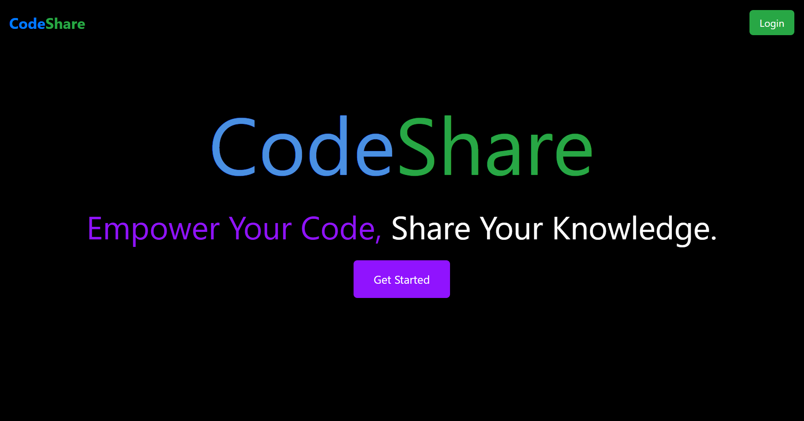
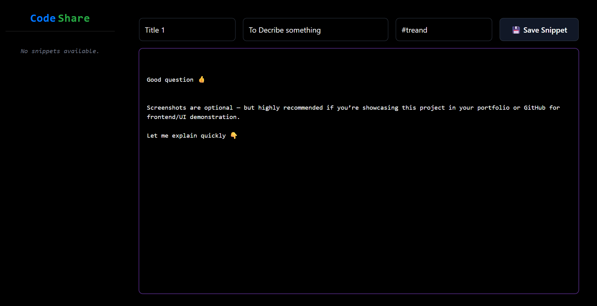
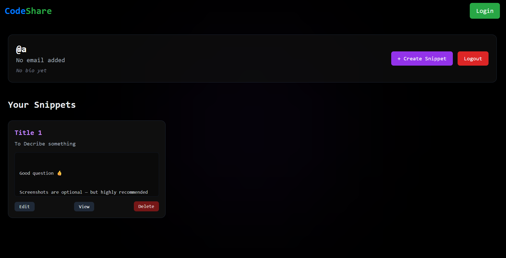
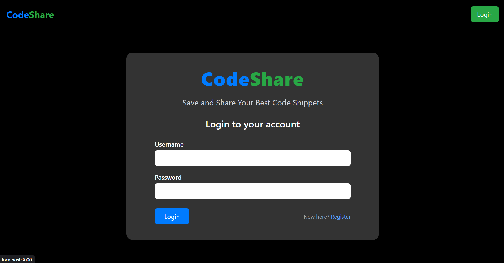

# 🚀 CodeShare  

**CodeShare** is a modern, responsive **frontend web app** that allows users to write, save, and organize their code snippets.  
It started as my **first full-stack project**, built to solve my own problem of keeping learning snippets and small experiments organized.  
Later, as I grew deeper into backend development, I discovered major security flaws and scalability issues in the initial backend.  

But instead of abandoning it, I decided to **rebuild CodeShare as a complete frontend-only project** —  
to showcase my **frontend design capabilities**, modern UI sense, and component-based thinking in React.  

---
🌐 Live Demo  
🔗 https://frontend-code-share-g3xmpfdx4-shivanshs-projects-fe2ba6c6.vercel.app/

---

## 🌱 Story Behind CodeShare  

When I began learning web development, I used to experiment a lot — small JS tricks, API calls, styling patterns — and save them in random files or notes.  
Over time, this became messy. I wanted a place where I could:  
- 🧩 Save small reusable code snippets  
- ✍️ Add short descriptions for each  
- 🔖 Tag them for better organization  

That’s how **CodeShare** was born — a personal project that evolved into my **first full-stack app** and later refined into a **frontend design showcase**.  

---

## 💥 Impact  

CodeShare taught me how to **think like a developer** — from designing UI to structuring data and managing state.  
It pushed me to explore **React architecture, routing, and component reusability** while building something that solved my own real problem.  
Now, as a purely frontend project, it represents my **growth in clean design, layout handling, and responsive experience**.  

---

## 🧩 What CodeShare Represents  

- 🧠 My journey from learning **full-stack fundamentals** → mastering **frontend architecture & design**  
- 🎨 A demonstration of my ability to build **interactive, consistent, and mobile-friendly interfaces**  
- 💡 A creative remake of my early project with **modern React patterns** and **Tailwind-based layouting**  

---

## 🧰 Tech Stack  

- ⚛️ **React.js**  
- 🌬️ **Tailwind CSS**  
- 🔥 **React Hot Toast**  
- 🧭 **React Router DOM**  
- 💾 **Local Storage**  

---

## ⚙️ Features  

✅ Write and edit code using an integrated editor  
✅ View, share, and organize snippets  
✅ Login & Register UI (local session mock)  
✅ Personalized profile view  
✅ Fully responsive (desktop ↔ mobile adaptive layout)  
✅ Toast notifications for feedback  
✅ Local storage for persistent sessions  
✅ Sidebar + Editor layout that changes by screen size  
&nbsp;&nbsp;&nbsp;➡ **Horizontal on desktop**, **Vertical on mobile**

---

## 🗂️ Folder Structure  

src/  
├── components/  
│ ├── CodeEditor.jsx  
│ ├── CodeSnippetCard.jsx  
│ ├── CodeViewer.jsx  
│ └── Sidebar.jsx  
│  
├── pages/  
│ ├── Editpage.jsx  
│ ├── Homepage.jsx  
│ ├── Loader.jsx  
│ ├── Loginpage.jsx  
│ ├── Mainpage.jsx  
│ ├── Navbar.jsx  
│ ├── Profilepage.jsx  
│ ├── Registerpage.jsx  
│ └── Viewpage.jsx  
│  
└── App.jsx  

---

###

🛠️ Setup Guide

```bash
# Clone this repository
git clone https://github.com/shivp0404/FrontendCodeShare

# Navigate into the project folder
cd codeshare

# Install dependencies
npm install

# Start the development server
npm start

# Once it runs, visit:
👉 http://localhost:5173 (Vite default port)
```

---

## 🖼️ Screenshots

### 🏠 Homepage


### 💻 Code Editor


### 👤 Profile Page


### 📱 Login Page


---

🪄 Design Philosophy  
Minimal black UI with subtle purple accents  
Code-first interface for focus and readability  
Consistent typography with developer aesthetic  
Fast and lightweight build using Vite  

---


🧩 Related Work  
🧠 NeuralStack → My upgraded version of CodeShare with a robust, secure, and scalable backend built using advanced Node.js and security practices.

---

⚖️ License  
This project is open-sourced under the MIT License.

---

🙏 Acknowledgments  
React.js  
Tailwind CSS  
React Hot Toast  
React Router DOM  

💬 “CodeShare is not just a project — it’s the reflection of my learning curve, from curiosity to clarity.”

---